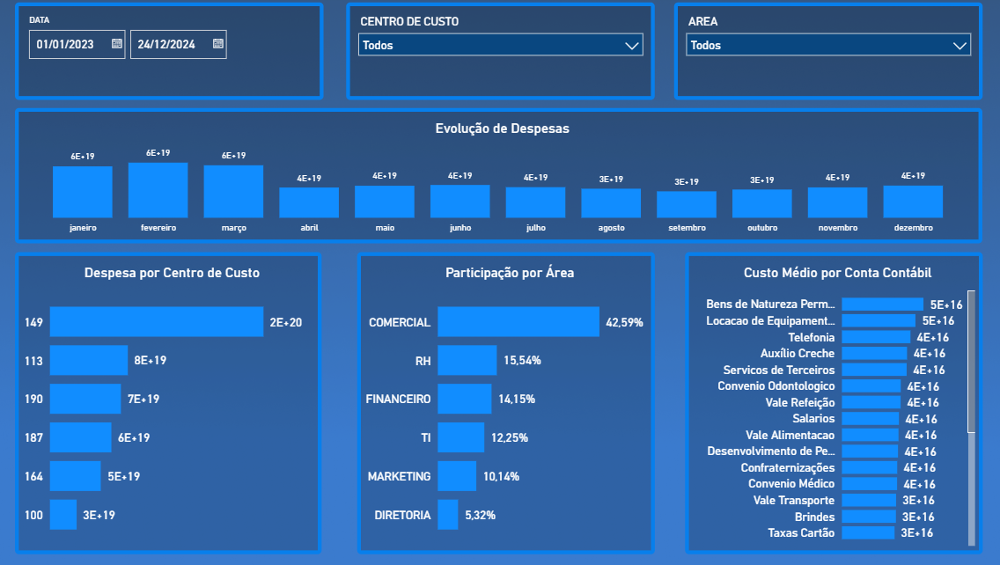

# 📊 Dashboard Financeiro

---

## 📌 Sobre o Projeto
Este repositório contém um **dashboard interativo** desenvolvido no **Power BI**, com foco em **análise financeira**.  
O projeto utiliza **Power Query** para tratamento de dados, **DAX** para criação de métricas e **modelagem de dados** para garantir insights claros e objetivos.

Este projeto simula um **cenário corporativo real**, sendo uma ótima ferramenta para **gestão e tomada de decisão baseada em dados**.

---

## 🚀 Tecnologias Utilizadas
- **Power BI Desktop**  
- **Power Query** (ETL – Extração, Transformação e Carga)  
- **DAX (Data Analysis Expressions)**  
- **Modelagem de Dados**

---

## 📂 Estrutura do Repositório
- `Dashboard - Financeiro.pbix` → Arquivo principal do dashboard (abrir no **Power BI Desktop**)  
- `Financeiro.png` → Imagem prévia do dashboard  

---

## 📈 Relatório

### 🔹 Dashboard Financeiro

---

## 🔎 Como Utilizar
1. Baixe o arquivo `Dashboard - Financeiro.pbix`  
2. Abra no **Power BI Desktop**  
3. Explore os relatórios de forma interativa  

---
✍️ Desenvolvido por **Patrícia Rocha**  
